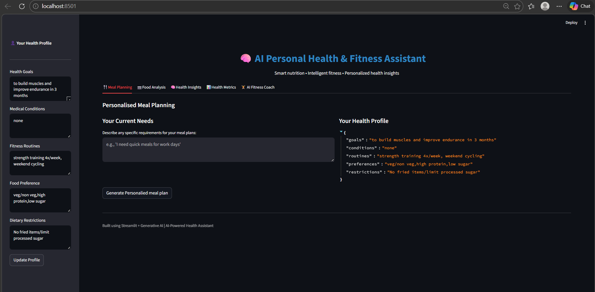
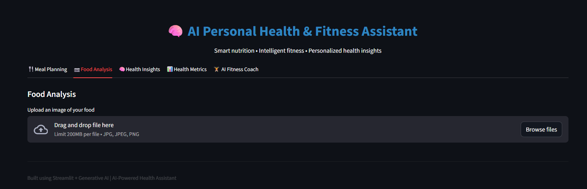
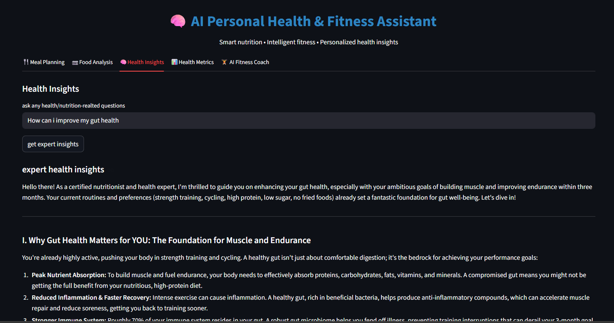
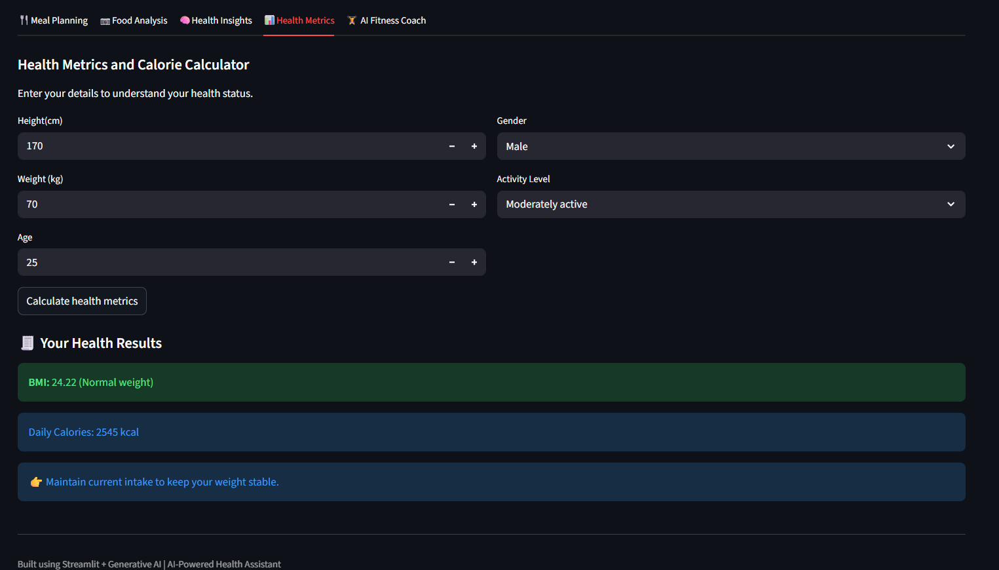
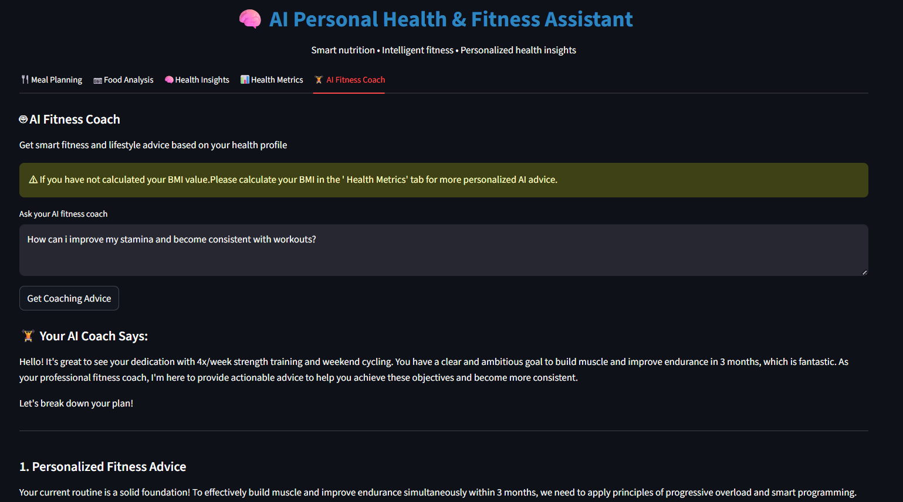

<h1 align="center">AI-Powered Personal Health, Diet Planner & Fitness Assistant</h1>

<p align="center">
Streamlit • Generative AI • Health Analytics • Fitness Planning
</p>

---

## 📌 Project Overview
This project is an AI-powered Personal Health, Diet Planner and Fitness Assistant built using Python and Streamlit. The application uses Google Gemini AI to generate personalized meal plans, health insights, food analysis, and fitness coaching based on the user's health profile.

The system also includes BMI calculation, calorie requirement estimation, and AI-based nutrition and fitness recommendations.

---

## 🚀 Features
- Personalized Meal Planning
- Food Image Analysis
- Health Insights using AI
- BMI Calculator
- Daily Calorie Calculator
- AI Fitness Coach
- Shopping List Generator
- Personalized Diet Recommendations

---

## 🛠 Technologies Used
- Python
- Streamlit
- Google Gemini API
- Pandas
- NumPy
- Pillow
- dotenv
- Generative AI

---

## ▶ How to Run
```bash
pip install -r requirements.txt
streamlit run app.py

## 📷 Application Screenshots

### Home Page


### Meal Planning


### Food Analysis


### Health Insights


### Health Metrics


### AI Fitness Coach

